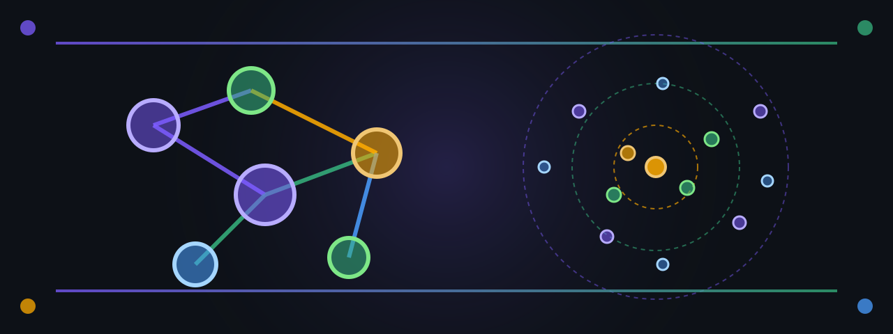

<p align="center">
  
</p>

[](https://github.com/paiml/helixdb-from-zero/actions/workflows/ci.yml)
[](#license)
[](rust-toolchain.toml)
[](contracts/helix-rust-v1.yaml)

# HelixDB From Zero — Companion Repo

The runnable companion to the Coursera course **HelixDB From Zero**, course
#20 in the *Rust for Data Engineering* specialization.

This repo bundles a Docker Compose stack for HelixDB (graph + vector
database), a small `helix-core` Rust crate that talks to HelixDB over HTTP,
and four named runtime contracts (`C1`–`C4`) that the demo binary asserts
against a live instance.

## Quick start

```bash
git clone https://github.com/paiml/helixdb-from-zero
cd helixdb-from-zero
make up         # docker compose up + healthcheck
make demo       # cargo run --bin helix-demo
```

`make up` brings up HelixDB on `127.0.0.1:6969` and waits for the
healthcheck to flip green. `make demo` then exercises the four contracts
end-to-end and prints which assertion each one checked.

## Prerequisites

- Docker (Compose v2)
- Rust 1.95+ (`rust-toolchain.toml` pins automatically)
- `curl` (for the healthcheck path)

## What's here

```
crates/helix-core/   Rust client + 4 named runtime contracts
contracts/           helix-rust-v1.yaml — formal spec for the four contracts
helix/               .hx schema + queries (push with `helix push`)
compose.yml          HelixDB single-node service
Makefile             entry points: up / demo / test / coverage / pmat / fmt / lint
assets/              hero.svg + hero.png
```

## Provable contracts

Each public async function in `crates/helix-core/src/lib.rs` asserts a
named runtime contract immediately after the HTTP round trip. Formal spec
lives in [`contracts/helix-rust-v1.yaml`](contracts/helix-rust-v1.yaml).

| Contract                          | Asserted in                            |
|-----------------------------------|----------------------------------------|
| `vertex_round_trip` (C1)          | `vertex_round_trip()`                  |
| `edge_traversal` (C2)             | `edge_traversal()`                     |
| `vector_top_k_contains_self` (C3) | `vector_top_k_contains_self()`         |
| `upsert_idempotent` (C4)          | `upsert_idempotent()`                  |

A breach panics with the contract name in the message; the demo binary
walks all four against the running HelixDB and aborts loudly on any
violation rather than ship corrupt state downstream.

## Commands

```bash
make up         # docker compose up -d (HelixDB on 127.0.0.1:6969)
make demo       # cargo run --bin helix-demo (4 contracts, live engine)
make test       # cargo test --release
make coverage   # cargo llvm-cov --release --workspace
make lint       # cargo clippy --all-targets -- -D warnings
make fmt        # cargo fmt --all
make pmat       # pmat quality-gate
make down       # docker compose down (preserves the volume)
make nuke       # docker compose down -v (wipes graph + vector index)
```

## Course Materials

This repo is the companion to the Coursera course **HelixDB From Zero**,
part of the [Rust for Data Engineering](https://github.com/paiml/rust-de-specialization)
specialization. Lessons walk through the four contracts as a path through
HelixDB's primitives (vertices, edges, vectors, idempotent upsert) and the
shape of building a small Rust service that talks to a graph-vector
backend.

## License

Dual-licensed under [MIT](LICENSE-MIT) **OR** [Apache-2.0](LICENSE-APACHE).
HelixDB itself is AGPL-3.0; this repo depends on the published Docker
image and the HTTP API surface, so the AGPL clause does not propagate to
this companion code.
